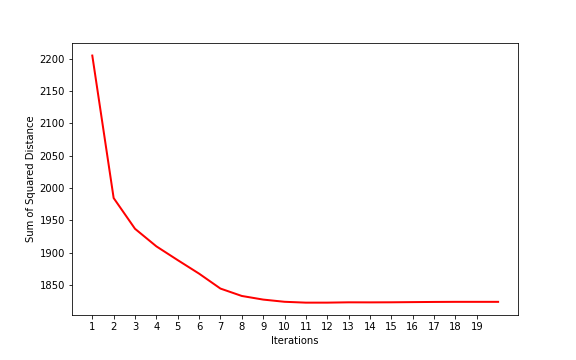
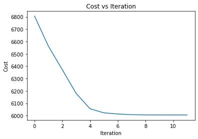

# DM-A3-KMeans

TODOs:   
[x] - Naive Python implementation  
[X] - PySpark MapReduce implementation 

## Using the python implementation, the loss looks like this:

    

## Using the python implementation, the loss looks like this:

